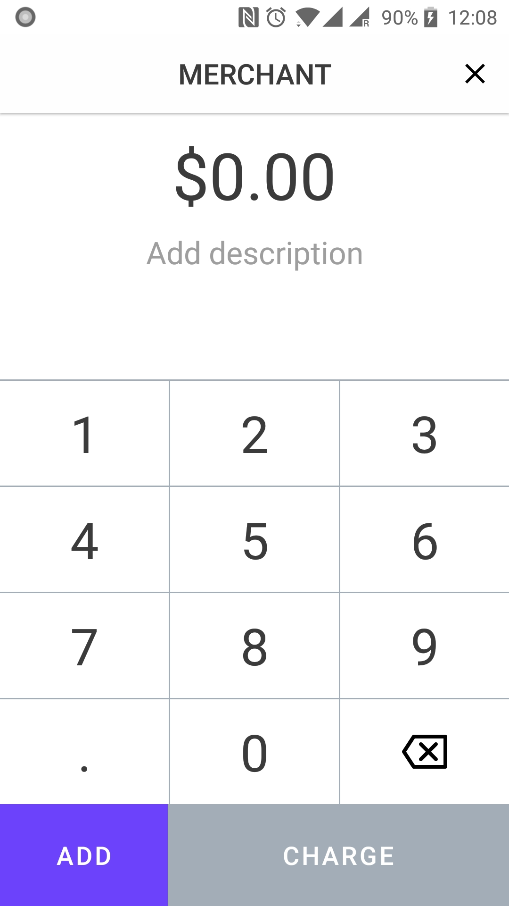
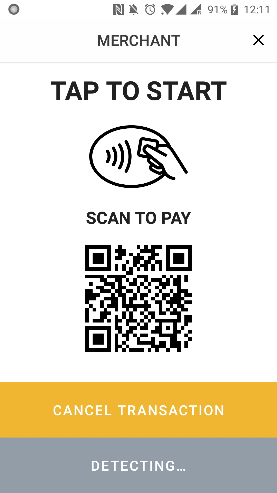

# Radix DLT Android POS

This branch of Radix DLT Android POS `release/1.0.0-beta` is the start of what is to come from our future public _BETANET_ release.

The Radix DLT Android POS currently works with the _BETANET_ universe and interacts with it
by making full use of the latest release of the [radixdlt-java](https://github.com/radixdlt/radixdlt-java/tree/release/1.0.0-beta.1) under the release/1.0.0-beta branch.

&nbsp;
&nbsp;
&nbsp;

## Development setup

Use Android Studio 3.5 Preview (or newer) to be able to build the app.

#### Card Setup

In order to flash and use your own nfc cards, please see the [radixdlt-card-applet](https://github.com/radixdlt/radixdlt-card-applet) project.

Cards and devices which will run this app *must* support extended length APDU format

The current implementation of the POS app is currently developed to listen to one type of token.
This means that if a token has been created in the radix universe and this is the token that we want to accept,
this must be set in the [Constants.kt](https://github.com/radixdlt/radixdlt-pos-android/blob/master/app/src/main/java/com/radixdlt/android/apps/pos/util/Constants.kt) file for both the `TOKEN_REFERENCE_ADDRESS` and `TOKEN_REFERENCE_SYMBOL` constants.

Current values below work with the Radix Hosted Betanet node:

`const val TOKEN_REFERENCE_ADDRESS = “9gktrzDLiwxDXSxcpV9PQEkBr59g5vrvRhoXC4YPBXnTi5hsRzg”`  
`const val TOKEN_REFERENCE_SYMBOL = “USD”`

#### POS App Setup

Bootstrap to your desired network by modifying the bootstrapConfig variable in the [RadixPOSApplication.kt](https://github.com/radixdlt/radixdlt-pos-android/blob/release/1.0.0-beta/app/src/main/java/com/radixdlt/android/apps/pos/RadixPOSApplication.kt) file.

The bootstrap variable will look like `private val bootstrapConfig = BootStrapConfigAndroidImpl.macAndroidEmulator()` where you can choose 3 options using the BootStrapConfigAndroidImpl.class.  

The 3 options are:

 * `BootStrapConfigAndroidImpl.radixBetanetNode()` (Used when connecting to the hosted radix betanet node)

 * `BootStrapConfigAndroidImpl.macAndroidEmulator()` (Used when connecting to a running localnode on your mac and also running the android emulator)
 
 * `BootStrapConfigAndroidImpl.localHost()` (Can take a String argument)
   - By default it will try to connect to "localhost" which will connect to your android emulator running on your Windows PC. This function can also take an argument as a String and can be an IP address or URL.  
     
   e.g.  
   `BootStrapConfigAndroidImpl.localHost("192.168.0.2")` (`"192.168.0.2"` is the IP address given by the router to your computer to connect your physical android phone via LAN)  
   **or**  
   `BootStrapConfigAndroidImpl.localHost("5.71.214.26")` (`"5.71.214.26"`is the IP address given by your ISP and you can connect to it as long as port 8080 has been forwarded on your router)

## Code style

This project uses [ktlint](https://github.com/pinterest/ktlint) via [Gradle](https://gradle.org/) dependency.
To check code style - `gradle ktlint` (it's also bound to `gradle check`).

## Android development

 * Written in [Kotlin](https://kotlinlang.org/)
 * Uses [Architecture Components](https://developer.android.com/topic/libraries/architecture/): ViewModel, LiveData
 * Uses [RxJava 2](https://github.com/ReactiveX/RxJava) (Included by default by the radixdlt libs)

## Contribute

Contributions are welcome, we simply ask to:

* Fork the codebase
* Make changes
* Submit a pull request for review

When contributing to this repository, we recommend discussing with the development team the change you wish to make using a [GitHub issue](https://github.com/radixdlt/radixdlt-pos-android/issues) before making changes.

Please follow our [Code of Conduct](CODE_OF_CONDUCT.md) in all your interactions with the project.

## Links

| Link | Description |
| :----- | :------ |
[radixdlt.com](https://radixdlt.com/) | Radix DLT Homepage
[documentation](https://docs.radixdlt.com/) | Radix Knowledge Base
[forum](https://forum.radixdlt.com/) | Radix Technical Forum
[@radixdlt](https://twitter.com/radixdlt) | Follow Radix DLT on Twitter

## Have a question?

If you need any information, please visit our [GitHub Issues](https://github.com/radixdlt/radixdlt-pos-android/issues)

## License

Radix DLT Android POS is released under the [MIT License](LICENSE).